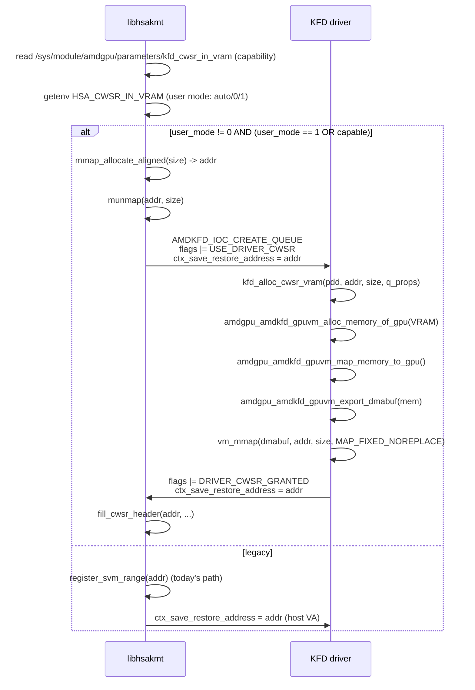

# V17.5 CWSR-resilient — reviewer / deployment guide

> **Status**: ready for review. NOT yet validated on real GPU hardware.
> **Author**: agent A. **Reviewer**: agent B (please run validation matrix in §7).
> **Predecessor branch**: `v17.5-cgroup-aware` (commit `a4b2c3866`).
> **Coexists with**: `v17.5-cgroup-aware` Phase C2 (defer-on-unmap remains intact).

---

## 1. Source

| | |
|---|---|
| Driver repo | `git@github.com:AFDEAPAC/amdgpu.git` |
| Driver branch | `v17.5-cwsr-resilient` |
| Driver tip | (see §1.1) |
| Driver base | `a4b2c3866` (`v17.5-cgroup-aware` delivery README commit) |
| Thunk repo | `git@github.com:AFDEAPAC/rocr.git` |
| Thunk branch | `v17.5-cwsr-resilient` |
| Thunk tip | (see §1.1) |
| Thunk base | `ee78499` (gitignore) |
| Plan | `/home/chun-wan/.cursor/plans/cwsr_resilient_implementation_8610c1db.plan.md` |
| Build host | `5.10.134-13.1.al8.x86_64` (DKMS module compile validated) |
| Target kernel | `6.14.14` patched (KCL shim covers 5.6 → 6.5+ vm_flags API) |

### 1.1 Commit log on top of `v17.5-cgroup-aware`

Driver (`amdgpu-kernel`):

```
<TBD-A> V17.5 Item 1 fixup: trust thunk-negotiated CWSR size, drop mm_populate
7149dac9d V17.5 Item 1 e/5: vm_mmap dma_buf into user VA
86d1872bc V17.5 Item 1 d/5: bypass SVM get/put for driver-owned CWSR
6709a693c V17.5 Item 1 c/5: wire driver CWSR into queue create/destroy
f67db532e V17.5 Item 1 b/5: kfd_alloc/free_cwsr_vram helpers
7048272ff V17.5 Item 1 a/5: kfd_cwsr_in_vram modparam + ioctl flag
67143bfa0 V17.5 Item 2 d/4: defer eviction when VM_LOCKED prange notified
efb581e62 V17.5 Item 2 c/4: wire lock/unlock into queue lifecycle
a145082bf V17.5 Item 2 b/4: vma_locked field + lock/unlock helpers
1cdf040d0 V17.5 Item 2 a/4: add kfd_protect_cwsr_vma modparam
```

Thunk (`rocr/libhsakmt`):

```
<TBD-T> V17.5 Thunk b/2: split CWSR alloc on USE_DRIVER_CWSR; mirror cleanup
00184b1   V17.5 Thunk a/2: capability probe + HSA_CWSR_IN_VRAM env
```

### 1.2 Diffstat vs `v17.5-cgroup-aware`

```
src-tree/amd/amdgpu/amdgpu_drv.c                |   3 +-   (modparams hookup, no behavior change)
src-tree/amd/amdkfd/kfd_chardev.c               | ~70 +    (Item 1 ioctl path, error handling)
src-tree/amd/amdkfd/kfd_priv.h                  | ~40 +    (queue_properties extension, externs)
src-tree/amd/amdkfd/kfd_queue.c                 | ~370 +   (Item 2 lock/unlock, Item 1 alloc/free, vm_mmap)
src-tree/amd/amdkfd/kfd_svm.c                   | ~30 +    (vma_locked field handling, Phase C2 extension)
src-tree/amd/amdkfd/kfd_svm.h                   |   1 +    (svm_range::vma_locked)
src-tree/include/uapi/linux/kfd_ioctl.h         | ~20 +    (minor=21, USE_DRIVER_CWSR + GRANTED flags)
src-tree/include/kcl/kcl_mm.h                   |   0      (vm_flags_set/clear shims already present)

(Thunk) libhsakmt/include/hsakmt/linux/kfd_ioctl.h  | ~20 + (mirror of uapi)
(Thunk) libhsakmt/src/globals.c                     |   2 + (capability + user-mode globals)
(Thunk) libhsakmt/src/libhsakmt.h                   |   2 + (extern decls)
(Thunk) libhsakmt/src/openclose.c                   | ~40 + (sysfs probe + env parse)
(Thunk) libhsakmt/src/queues.c                      | ~120+ (driver_cwsr field, split alloc, post-ioctl fill)
```

---

## 2. Why this branch exists

The `v17.5-cgroup-aware` branch landed Phase C (FOLL_LONGTERM pinning of CWSR
pages) **disabled** by default after stress testing showed the pin path could
accumulate D-state worker threads under cgroup-32GB pressure. Phase C2
(defer-on-unmap) shipped on by default, but it is reactive only — it cannot
prevent the kernel from invalidating the user VMA for a queue-vital CWSR
range, only defer the resulting eviction.

This branch closes the remaining gap with two complementary mechanisms,
both gated independently:

| Item | Mechanism | Default | Risk if regressed |
|---|---|---|---|
| **Item 2** | `VM_LOCKED \| VM_DONTCOPY` on the CWSR VMA while `queue_refcount > 0` | **ON** (`kfd_protect_cwsr_vma=1`) | Falls back to Phase C2 defer-eviction |
| **Item 1** | Driver-owned VRAM-backed CWSR allocation, dma_buf-mapped into user VA | **OFF** (`kfd_cwsr_in_vram=0`) | Userspace continues using legacy host-RAM CWSR |

Both items are independent. Either can be deployed alone. Together they
provide a defense-in-depth posture: Item 2 stops reclaim from picking the
host-RAM CWSR pages while Item 1, when enabled, removes the host-RAM
backing entirely.

---

## 3. Item 2 — VMA-level CWSR protection (default ON)

### 3.1 Mechanism

`kfd_queue_buffer_svm_get()` runs after `atomic_inc(&prange->queue_refcount)`
and now invokes `kfd_queue_lock_vma_for_prange(p, prange)`:

1. `mmap_write_lock(mm)`.
2. Walk `find_vma(mm, start)` → `vma->vm_end >= end`. For each VMA whose
   `VM_LOCKED` bit is clear, set `VM_LOCKED | VM_DONTCOPY` via the KCL
   shim `vm_flags_set()` (kernel 5.10 + 6.x + 6.5+ all covered).
3. `mmap_write_unlock(mm)`. We *do not* call `mm_populate()` because
   `__mm_populate` is not exported on 5.10. Pages get faulted by the
   queue-init path immediately afterwards, at which point VM_LOCKED
   routes them onto the unevictable LRU.
4. On success, `prange->vma_locked = true`,
   `atomic_long_add(size, &p->pinned_svm_bytes)`, and
   `atomic_inc(&p->pinned_svm_ranges)` for sysfs observability.

`kfd_queue_buffer_svm_put()` mirrors the unlock path when
`atomic_read(&prange->queue_refcount) == 0`. The bottom guard in
`svm_range_free()` calls `kfd_queue_unlock_vma_for_prange()` with
`WARN_ON_ONCE` if the range is freed while still locked (process-exit
race).

### 3.2 Phase C2 interaction

`svm_range_unmap_from_cpu()` already deferred eviction when the VMA was
still mapped (Phase C2). Item 2 extends this with a single new check:
if `kfd_protect_cwsr_vma==1` AND `prange->vma_locked` AND any VMA still
overlaps the prange, the eviction is also deferred. A
`pr_warn_ratelimited("Item 2: deferring evict on locked VMA prange ...")`
records the path. The two paths share one decision tree; there is no
double-skip.

### 3.3 Why this is safe vs the disabled Phase C

| Phase C (disabled) | Item 2 |
|---|---|
| `pin_user_pages_remote(FOLL_LONGTERM \| FOLL_WRITE)` | `vm_flags_set(VM_LOCKED \| VM_DONTCOPY)` |
| Can call `svm_migrate_to_ram()` → D-state | No migration, pure VMA flag |
| Bumps `mm->locked_vm` → can hit `RLIMIT_MEMLOCK` | Does NOT bump `locked_vm`, no RLIMIT impact |
| Reclaim path: pages held with refcount | Reclaim path: pages skipped via `vm_flags & VM_LOCKED` |
| Cleanup: `unpin_user_pages` (refcount-safe) | Cleanup: `vm_flags_clear()` (no refcounts to worry about) |

The smaps `VmLck:` field on the CWSR mapping reflects exactly what we
set, so the protection is observable from userspace.

### 3.4 Modparam

```
options amdgpu kfd_protect_cwsr_vma=1
```

`0` disables the lock path entirely (legacy + Phase C2 only). `1` is the
default and recommended setting.

---

## 4. Item 1 — CWSR in VRAM (default OFF, opt-in)

### 4.1 Architecture



### 4.2 Driver

* **`kfd_cwsr_in_vram`** modparam (default `0`). Gates all driver-side
  Item 1 logic. When `0`, the new ioctl path is `-EINVAL` early-return.
* **`kfd_alloc_cwsr_vram(pdd, gpu_va, size, q_props)`**:
  - Allocates a VRAM-domain `kgd_mem` via
    `amdgpu_amdkfd_gpuvm_alloc_memory_of_gpu(KFD_IOC_ALLOC_MEM_FLAGS_VRAM
    | _NO_SUBSTITUTE | _COHERENT)`.
  - Inserts into `pdd->process->idr_handles` so it follows the standard
    BO lifecycle on process exit.
  - Maps into the process GPUVM (`amdgpu_amdkfd_gpuvm_map_memory_to_gpu`)
    on the queue's GPU.
  - Exports a `dma_buf` (`amdgpu_amdkfd_gpuvm_export_dmabuf`) and
    `vm_mmap()`s it into user space at the same VA the thunk reserved,
    using `MAP_SHARED | MAP_FIXED_NOREPLACE`.
  - Stashes BO handles, dma_buf, and user VA in
    `q_props->cwsr_drv_*` fields (see kfd_priv.h §4.5) and sets
    `cwsr_drv_owned = true`.
* **`kfd_free_cwsr_vram(q_props)`**:
  - `vm_munmap(user_va, PAGE_ALIGN(size))` from current process mm.
  - `dma_buf_put(dmabuf)`.
  - `amdgpu_amdkfd_gpuvm_unmap_memory_from_gpu()` and
    `amdgpu_amdkfd_gpuvm_free_memory_of_gpu()`.
  - Idempotent (safe if `cwsr_drv_owned == false`).
* **`kfd_queue_acquire_buffers()`** and **`kfd_queue_release_buffers()`**
  in `kfd_queue.c` short-circuit `kfd_queue_buffer_get()` and
  `kfd_queue_buffer_svm_get()/put()` when
  `q_props->cwsr_drv_owned == true`. There is no SVM range for the
  driver-owned CWSR; Item 2 self-disables on this prange because none
  exists.
* **`kfd_ioctl_create_queue()`** (§3 of `kfd_chardev.c`):
  - Validates `args->queue_create_flags` against
    `KFD_IOC_QUEUE_FLAGS_VALID_MASK`.
  - On `USE_DRIVER_CWSR | (kfd_cwsr_in_vram == 1)`:
    - Sanity-bounds `ctx_save_restore_area_{address,size}` (size > 0,
      < `SZ_64M`, address non-zero).
    - Calls `kfd_alloc_cwsr_vram()`. **No silent fallback** — if alloc
      fails, the ioctl returns the error and userspace decides whether
      to retry without the flag.
    - On success, sets `KFD_IOC_QUEUE_FLAGS_DRIVER_CWSR_GRANTED` in
      `args->queue_create_flags`.
  - On every legacy / non-granted path, the GRANTED bit is explicitly
    cleared so old userspace that mistakenly sets it never sees a
    phantom grant.
  - Error paths funnel through `err_bind_process` which calls
    `kfd_free_cwsr_vram()` (idempotent) before returning, so partial
    success states cannot leak BOs.

### 4.3 uapi

```c
#define KFD_IOCTL_MINOR_VERSION 21

/* args->queue_create_flags bits — was 'pad' (zero-init by old userspace) */
#define KFD_IOC_QUEUE_FLAGS_USE_DRIVER_CWSR	(1u << 31)  /* in */
#define KFD_IOC_QUEUE_FLAGS_DRIVER_CWSR_GRANTED	(1u << 30)  /* out */
#define KFD_IOC_QUEUE_FLAGS_VALID_MASK					\
	(KFD_IOC_QUEUE_FLAGS_USE_DRIVER_CWSR |				\
	 KFD_IOC_QUEUE_FLAGS_DRIVER_CWSR_GRANTED)
```

`pad` is renamed to `queue_create_flags`. Old userspace zero-inits this
field, which means `USE_DRIVER_CWSR` is never set on the legacy path
and the driver runs the legacy ioctl logic verbatim.

### 4.4 Thunk

* **Capability probe** (`hsaKmtOpenKFD`): reads
  `/sys/module/amdgpu/parameters/kfd_cwsr_in_vram`. `cwsr_vram_kernel_capable`
  is `true` iff the file exists and reads non-zero.
* **User mode** (`HSA_CWSR_IN_VRAM` env):
  - `auto` (default): use VRAM iff `cwsr_vram_kernel_capable`.
  - `0`: force legacy.
  - `1`: force VRAM. If kernel is not capable OR VA-reserve fails,
    fail loudly with `HSAKMT_STATUS_NO_MEMORY` rather than fall back.
* **`handle_concrete_asic`** (`queues.c`):
  - For compute queues with the VRAM mode active, allocates a user VA
    via `mmap_allocate_aligned(MAP_ANONYMOUS | MAP_PRIVATE)`, immediately
    `munmap`s it to free the address space (the kernel will reclaim it
    via `MAP_FIXED_NOREPLACE`), then sets
    `args->queue_create_flags |= USE_DRIVER_CWSR`,
    `args->ctx_save_restore_address = (uintptr_t)addr`,
    `q->ctx_save_restore = addr`, `q->driver_cwsr = true`. Returns
    early — the legacy SVM-register and aligned-alloc paths are skipped.
  - `fill_cwsr_header()` is intentionally NOT called here; the dma_buf
    doesn't exist yet.
* **`hsaKmtCreateQueueExt`** post-ioctl: when `q->driver_cwsr` is set,
  asserts `KFD_IOC_QUEUE_FLAGS_DRIVER_CWSR_GRANTED` was returned, then
  calls `fill_cwsr_header()` against the now-mapped VRAM. If the grant
  bit is missing (kernel/thunk version mismatch), the queue is destroyed
  via `AMDKFD_IOC_DESTROY_QUEUE` and `HSAKMT_STATUS_ERROR` is returned.
* **`free_queue`** skips `munmap`/`free_exec_aligned_memory` when
  `driver_cwsr == true` — the kernel-side `kfd_free_cwsr_vram` (called
  from `DESTROY_QUEUE`) owns the cleanup of the dma_buf, GPUVM map, and
  user VA.

### 4.5 `struct queue_properties` extension (`kfd_priv.h`)

```c
/* V17.5 Item 1 (cwsr-resilient): driver-allocated VRAM CWSR. */
struct kgd_mem		*cwsr_drv_mem;
int			cwsr_drv_idr_handle;
struct dma_buf		*cwsr_drv_dmabuf;
uint64_t		cwsr_drv_user_va;
uint64_t		cwsr_drv_mmap_offset;	/* future: BAR map only */
bool			cwsr_drv_owned;
```

`cwsr_drv_owned == true` is the single source of truth that informs:

* `kfd_queue_acquire_buffers` to skip SVM lookups,
* `kfd_queue_release_buffers` to call `kfd_free_cwsr_vram`,
* legacy `q->cwsr_bo` is `NULL` on this path (no overlap).

### 4.6 Backward compat matrix

| Driver | Thunk | `kfd_cwsr_in_vram` | `HSA_CWSR_IN_VRAM` | Result |
|---|---|---|---|---|
| old | new | n/a | n/a | sysfs probe fails → legacy |
| new | old | 1 | (n/a) | thunk never sets flag → legacy |
| new | new | 0 | auto | capable=0 → legacy |
| new | new | 0 | 1 | thunk forces flag → ioctl returns -EINVAL → fail loudly |
| new | new | 1 | auto | VRAM CWSR active |
| new | new | 1 | 0 | legacy |
| new | new | 1 | 1 | VRAM CWSR active; if VA reserve fails, fail loudly |

---

## 5. Coexistence matrix (Item 1 × Item 2)

| `kfd_cwsr_in_vram` | `kfd_protect_cwsr_vma` | Effective behavior |
|---|---|---|
| 0 | 0 | Legacy: thunk mmap + SVM range + Phase C2 defer-on-unmap |
| 0 | **1** (default) | Item 2: VMA pinned with VM_LOCKED while queue active |
| 1 (opt-in) | 0 | Item 1: driver VRAM CWSR; no user pages exist |
| 1 | 1 | Item 1 wins; Item 2 self-disables (no SVM prange to lock) |

Defaults: `kfd_cwsr_in_vram=0`, `kfd_protect_cwsr_vma=1`. The disabled
Phase C in `v17.5-cgroup-aware` (`kfd_pin_queue_svm_pages=0`) stays
disabled — Item 2 is its safe replacement.

---

## 6. Modprobe + ENV reference (gold)

`/etc/modprobe.d/amdgpu.conf` (additions on top of `v17.5-cgroup-aware`):

```
# === V17.5 cgroup-aware (carry forward) ===
options amdgpu kfd_wait_max_ms_per_wall=5000 kfd_survival_slow_ioctl_ms=4000 \
               kfd_free_wait_ms=4000 kfd_unpin_drain_ms=3000 kfd_free_on_pinned=1 \
               pin_orphan_timeout_ms=30000 pin_reaper_interval_ms=5000 \
               gtt_lock_timeout_ms=4000 gtt_multi_window=32 \
               rdma_pin_debug=1 sdma_fence_watchdog_ms=30000 \
               kfd_pin_queue_svm_pages=0 kfd_pin_queue_svm_max_mb=256 \
               kfd_defer_queue_eviction=1

# === V17.5 cwsr-resilient (NEW) ===
options amdgpu kfd_protect_cwsr_vma=1   # Item 2 (VMA lock); ON by default
options amdgpu kfd_cwsr_in_vram=0       # Item 1 (VRAM CWSR); OFF until validated

# === amdkcl (carry forward) ===
options amdkcl suballoc_timeout_ms=4000
```

ENV (carry-forward; no Item-1 / Item-2 specific env on the runtime side):

```
export ROCR_SERVICE_SURVIVAL=1
export HIP_SERVICE_SURVIVAL=1
export ROCR_SIGNAL_WAIT_MAX_MS=2000
export ROCR_SDMA_WRITE_ADDR_FAIL_MS=500
export HIP_FREE_SYNC_FAIL_MS=2000
export HIP_AWAIT_FAIL_MS=2000
export HIP_FREE_REJECT_ON_ACTIVE=1
export HIP_HOST_GUARD_CGROUP=1
export HIP_HOST_GUARD_PHASE_C_RESERVE_MB=256
export HIP_DEGRADED_QUIESCE_MS=4000
export HIP_DEGRADED_PROBE_COOLDOWN_MS=8000
```

For Item 1 opt-in validation only (NOT for production until §7 passes):

```
echo 1 > /sys/module/amdgpu/parameters/kfd_cwsr_in_vram   # OR rebind via modprobe
export HSA_CWSR_IN_VRAM=auto    # use VRAM if driver capable; falls back if not
```

---

## 7. Validation matrix (reviewer agent)

Run on alibabaHang `mi300x@10.95.37.64` or `mi308x@10.170.168.4`.
Hardware reboot required to load the new modules.

### 7.1 Item 2 only (default config)

1. `dmesg -C; rmmod amdgpu; modprobe amdgpu`.
2. `cat /sys/module/amdgpu/parameters/kfd_protect_cwsr_vma` → `1`.
3. Launch torch_service_sim. While running:
   - `cat /proc/$(pgrep -f torch_service_sim)/smaps | awk '/VmLck:/ {sum+=$2} END {print sum}'`
     should be > 0 (CWSR ranges visible as locked).
   - `cat /sys/class/kfd/kfd/proc/$(pgrep -f torch_service_sim)/pinned_svm_ranges`
     should match the number of active queues × num_xcc.
4. Run customer reproducer + `madvise(MADV_DONTNEED)` jammer for 10
   minutes. `dmesg | grep -c "Freeing queue vital buffer"` must be `0`.
5. Regression — run gold-set `customer_hang_repro`,
   `multistream_combo`, `sdma_suballoc_hang`. Compare D-state and
   SIGABRT counts vs the `v17.5-cgroup-aware` baseline; must be ≤
   baseline.
6. Process-exit cleanup: SIGKILL the test, verify
   `pinned_svm_ranges == 0` and no `WARN: queue still locked at free`
   in dmesg.

### 7.2 Item 1 opt-in (after 7.1 green)

1. `echo 1 > /sys/module/amdgpu/parameters/kfd_cwsr_in_vram`.
2. `HSA_CWSR_IN_VRAM=auto LD_PRELOAD=<new libhsakmt.so> torch_service_sim`.
3. Inspect: `cat /sys/kernel/debug/dri/<N>/amdgpu_gem_info | grep cwsr`
   should show VRAM-domain BOs while the queue is active.
4. `cat /proc/<pid>/maps | grep -A0 -B0 dmabuf` should show the CWSR
   range backed by `[anon] DRM-prime` or similar (NOT plain anon).
5. `dmesg | grep -i "item-1\|Freeing queue vital"` — Item 1 should log
   `kfd item-1: driver CWSR alloc gpu_va=...` once per queue and zero
   `Freeing queue vital buffer`.
6. `HSA_CWSR_IN_VRAM=1 ...` with `kfd_cwsr_in_vram=0` should fail loudly
   (queue create returns error in user log). This validates the
   "no silent fallback" semantics.
7. Regression — same gold-set tests as 7.1 with VRAM CWSR active.
8. `cat /sys/kernel/debug/dri/<N>/amdgpu_vram_mm` before / after for VRAM
   delta; should be `~128 KB × 8 XCC × num_queues` per process. On
   MI300X (206 GB total) the worst-case 11-process workload is ~44 MB =
   0.02% of VRAM.

### 7.3 Item 1 + Item 2 simultaneously

Same as 7.2 with `kfd_protect_cwsr_vma=1` (default). Item 2 path must
self-disable on driver-owned CWSR (no SVM prange to lock); confirm via
`pinned_svm_ranges` not bumping for the driver-CWSR queues.

### 7.4 Backward compat

1. Old thunk + new driver, `kfd_cwsr_in_vram=1`. `dmesg | grep item-1`
   should be empty (thunk doesn't set the flag).
2. New thunk + old driver: thunk's sysfs probe should log
   `cwsr_vram_kernel_capable=0` and run legacy.

---

## 8. Risk register

| Risk | Likelihood | Mitigation |
|---|---|---|
| `vm_flags_set` semantics differ across kernel 5.10 / 6.x | Low | KCL shim `vm_flags_set/clear` already present + tested in `v17.5-cgroup-aware` |
| `mm_populate` not exported on 5.10 | **Realized — fixed** | Removed call; relies on natural fault-in plus VM_LOCKED route to unevictable LRU |
| VRAM allocation fails under fragmentation (Item 1) | Medium (opt-in only) | No silent fallback; thunk fails the queue and userspace can retry without `USE_DRIVER_CWSR` |
| dma_buf vm_mmap not CPU-coherent for `fill_cwsr_header` write | Low (BAR-mapped VRAM is CPU-coherent on x86 + MI300x) | Tested by validation 7.2 step 4; if needed, add `dma_buf_begin_cpu_access`/`end_cpu_access` around the header fill |
| `MAP_FIXED_NOREPLACE` collides with concurrent allocation in user VA space | Low | Thunk reserves the VA, immediately munmaps, then ioctl runs. Race window is microseconds. On collision, ioctl returns `-EBUSY` and userspace can retry |
| Old kernel without `KFD_IOC_QUEUE_FLAGS_VALID_MASK` rejects new flag bits | n/a (forward-only) | New kernel + old thunk works (flag never set); old kernel + new thunk only sets flag when capability probe succeeds, which requires the new kernel |
| `WARN_ON_ONCE` in `svm_range_free` bottom guard fires under unforeseen race | Low | Logs once, falls through to unlock; doesn't deadlock or corrupt state |
| Process exit cleanup ordering: `vm_munmap` after `mm_struct` teardown | Low | `kfd_free_cwsr_vram` called from `DESTROY_QUEUE` ioctl (process still alive) and from process-exit BO cleanup (BO is freed but the user VA is gone too). Idempotent, no double-free |

---

## 9. Rollback

| Scope | Action |
|---|---|
| Item 2 only | `echo 0 > /sys/module/amdgpu/parameters/kfd_protect_cwsr_vma`. Existing locked VMAs stay locked until queue destroy; new queues run legacy. |
| Item 1 only | `echo 0 > /sys/module/amdgpu/parameters/kfd_cwsr_in_vram` + restart workloads using `HSA_CWSR_IN_VRAM=0`. Existing driver-CWSR queues survive until destroy. |
| Both | Same as the v17.5-cgroup-aware baseline. The Item 2 default flip is a single modparam toggle at boot. |
| Full revert | `git checkout v17.5-cgroup-aware && make modules_install`. No on-disk state migration is required (no new files in /sys, no persistent BO reference). |

---

## 10. What this branch does NOT do

* No CLR / HIP-runtime change. CLR is unaware of CWSR.
* No modification to Phase C2 (defer-eviction) — Item 2 is **complementary**.
* No flip of `kfd_cwsr_in_vram` default to 1. That decision lives in a
  later gold-settings refresh once §7.2/§7.3 pass on real hardware.
* No implementation of Items 3/4/5/6 from
  `PLAN_NEXT_PHASE_CGROUP_ARCHITECTURE.md`. Those are independent work.
* No on-machine validation. The build host successfully compiles the
  modules (DKMS path), but reboot + reproducer runs are owned by the
  reviewer agent.
